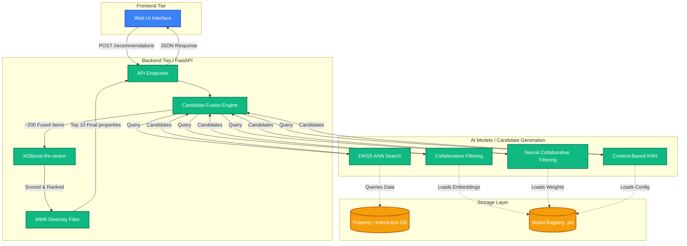

# Property Recommendation Engine

A highly optimized, multi-stage AI property recommendation engine built entirely in Python. It provides sub-100ms real-time personalized property recommendations by fusing four different machine learning models and re-ranking them using an XGBoost model.

## 🚀 Live Working System Diagram

Below is the live architecture flow of how the system processes a user's request for property recommendations:



## 📁 Project Structure

The project has been cleanly separated into two distinct tiers:

*   **`frontend/`**: Contains the visual web interface components (HTML, CSS, interactions).
*   **`backend/`**: Contains the core Python processing server, including:
    *   **`src/`**: Recommendation algorithms, AI Model classes, Database connectors, and the FastAPI application.
    *   **`models/`**: The local Model Registry that safely versions and stores the trained ML state (`.pkl` and `.keras` files) ensuring instant load times avoiding redundant retraining.
    *   **`data/`**: The property datasets and SQLite storage.
    *   **`config/`**: System runtime and variable configurations.
    *   **`main.py`**: The entry point for starting the API server and data generators.

## 🧠 Approach

Instead of relying on a single algorithm, this system utilizes a **Hybrid Two-Stage Recommender Pipeline**:

1.  **Candidate Generation (Recall)**:
    It queries 4 distinct AI instances in parallel to recall 50 distinct properties each:
    *   **Collaborative Filtering**: SVD models trained on historical User-Property impressions.
    *   **Content-Based**: KNN over deep 128-d property attribute vectors.
    *   **Deep Learning (NCF)**: A complex Multi-Layer Perceptron to catch non-linear correlations.
    *   **ANN Search (FAISS)**: Blazing fast approximate matches to the user's currently browsed listing.
2.  **Re-Ranking (Precision)**:
    Fuses the ~200 collective candidates and scores them directly using a robust 27-feature XGBoost model trained specifically on positive engagement signals (contacts/messages vs standard views).
3.  **Maximal Marginal Relevance (Diversity)**: 
    Injects a diversity score penalty so the user isn't just shown 10 identical properties next to one another.

For deep mathematical and statistical rationales behind the code, read the internal [`APPROACH.md`](APPROACH.md) notes!

## 🔧 Getting Started

To launch the unified backend server logic:

```bash
cd backend
python3 main.py --full  
```

Once initialized, you can query exactly how the pipeline evaluates a user in real time via standard API calls!
